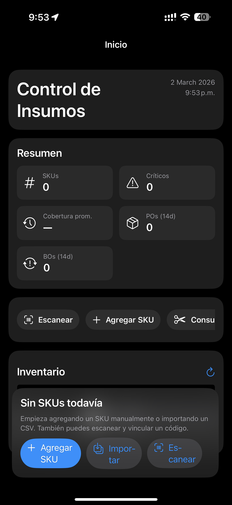
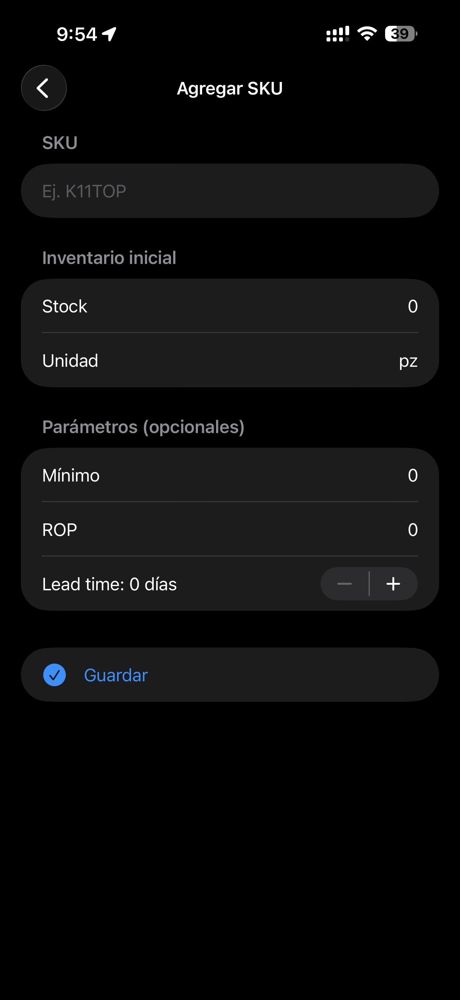
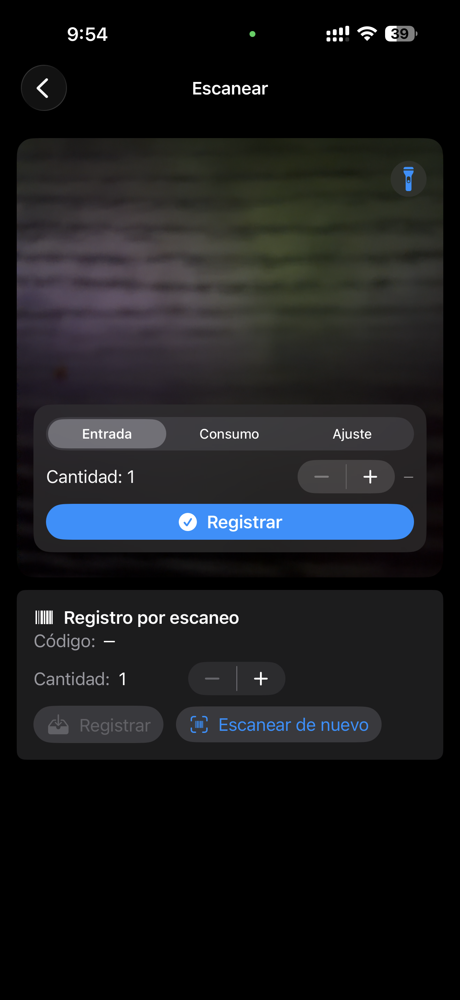

# Inventory (iOS)

App iOS para control de insumos y operaciones de inventario en piso: recepcion, consumo, conteo, ajustes y reabasto con sugerencias.

## Funcionalidades

- Dashboard con KPIs de inventario y cobertura (WoS).
- Catalogo de SKUs con alta rapida y detalle por producto.
- Escaneo de codigo de barras para vincular codigo -> SKU.
- Recepcion de entradas con referencia de factura/PO.
- Registro de consumos por area y turno.
- Ajustes de inventario (agregar, descontar, fijar a objetivo).
- Conteo ciclico con borrador y guardado masivo de ajustes.
- Reabasto sugerido con exportacion CSV y generacion de POs.
- Importacion CSV para alta/actualizacion de SKUs.

## Screenshots

| Inicio | Recepcion | Reabasto |
| --- | --- | --- |
|  |  |  |

## Stack tecnico

- Swift + SwiftUI
- Core Data (persistencia local)
- AVFoundation (scanner de camara)
- UIKit bridge (document picker para CSV)

## Ejecutar en local

1. Abre `Inventory.xcodeproj` en Xcode.
2. Selecciona el scheme `Inventory`.
3. Ejecuta en simulador o dispositivo iOS.

Nota: se requiere instalacion completa de Xcode (no solo Command Line Tools).

## Estructura principal

- `Inventory/HomeView.swift`: dashboard y navegacion principal.
- `Inventory/RecepcionView.swift`: entradas de inventario.
- `Inventory/ConsumoView.swift`: salidas/consumo.
- `Inventory/ConteoView.swift`: conteo ciclico.
- `Inventory/ReabastoView.swift`: sugerencias de compra/reabasto.
- `Inventory/ImportCSVView.swift`: importador CSV.
- `Inventory/BarcodeScannerView.swift`: escaneo de codigo de barras.
- `Inventory/Persistence.swift`: configuracion Core Data.

## Privacidad y datos

- No se incluyen llaves/API secrets en el repositorio.
- Los datos se guardan localmente en el dispositivo (Core Data).
- La camara solo se usa para escaneo de codigos.

## Estado

Proyecto activo en evolucion para portafolio.
